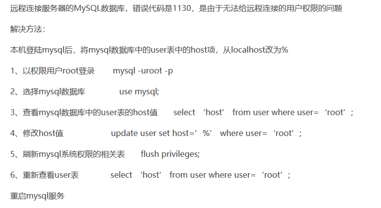
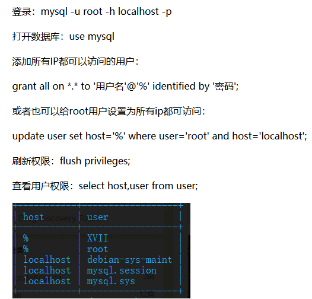

# 一、关于数据库远程连接的问题 #

我本想使用本地服务器上的php项目连接到远程服务器上的mysql数据库，但是无论如何都会下列错误出现

	ERROR 2003 (HY000): Can't connect to MySQL server on '39.100.232.14' (10060)

使用了下列网上的方法之后使用xshell连接数据库还多了一个错误

	Access denied for user 'root'@'localhost' (using password: YES)

### 第一种 ###

### 第二种 ###
